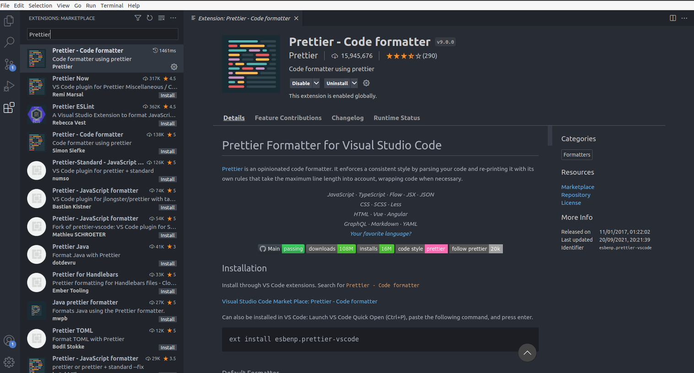
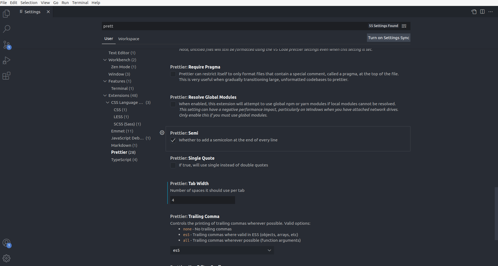

# Editor Setup Style Guide

This is our editor setup guide for configure editor.

## VS-Code Prettier:

Use prettier[ extension-id : esbenp.prettier-vscode ] for code formatting.

For download prettier On VS-Code follow the below process:

1. Go to Extensions with shortcut keys CTRL + SHIFT + X.

2. Search for “Prettier” as shown below the image.

After successfully installing prettier on your VS-Code configure Prettier as per the following rules:

    *Tab has 4 spaces.
    *quotes should be double

“For configuring prettier go to settings icon then hit setting option search for prettier then select on prettier in Extensions section following UI will be open then configure it. ( configure process solution may vary with vs code versions if this process not worked search it on google).”

## VS-Code Configurations and extensions:

-   Eslint

-   Prettier [publisher:"Prettier"]

-   ES7 React/Redux/GraphQL/React-Native snippets [publisher:"dsznajder"]

-   GitLens — Git supercharged [publisher:"GitKraken"]

-   JavaScript (ES6) code snippets [publisher:"charalampos karypidis"]

-   Short keys documentation
    -   Format document CTRL + SHIFT + I
    -   Organize imports CTRL + SHIFT + O